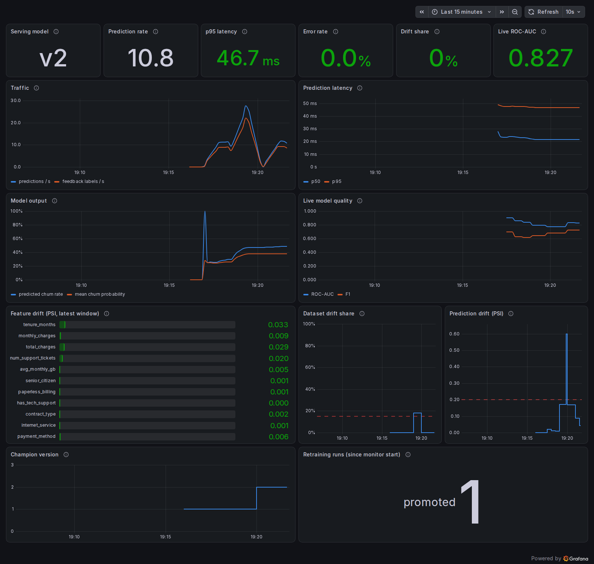
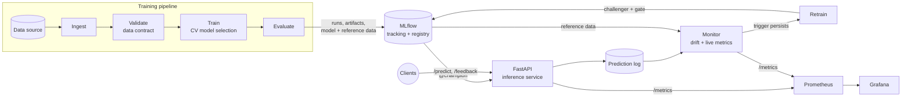
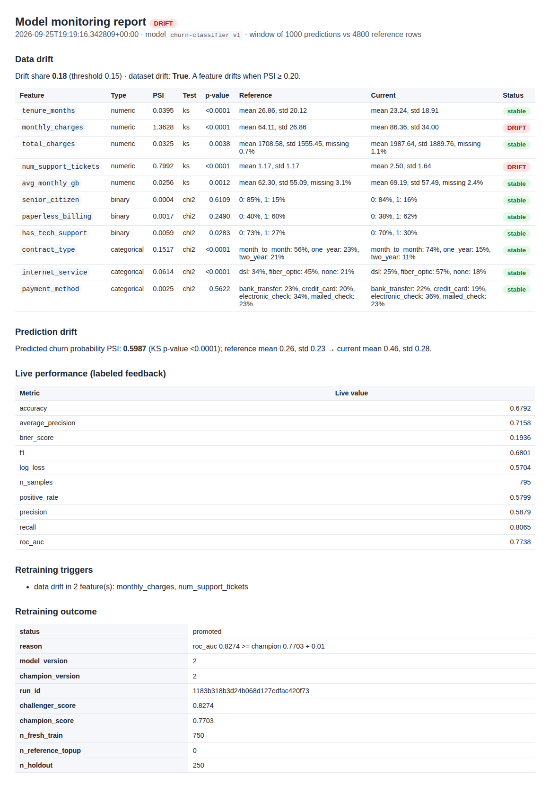
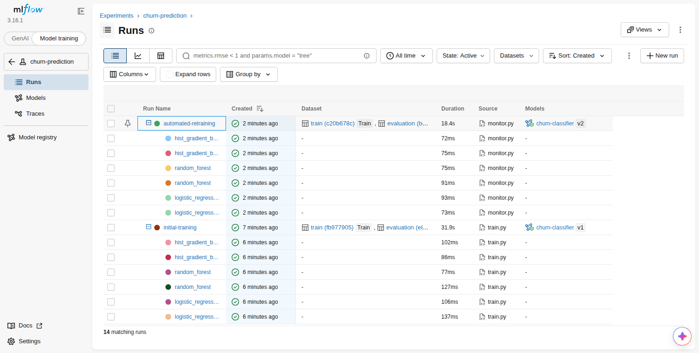

# End-to-End MLOps Pipeline: churn prediction that monitors and retrains itself

[](https://github.com/Prajwal-Pratap-Yadav/end-to-end-mlops-pipeline/actions/workflows/ci.yml)
[](pyproject.toml)
[](LICENSE)
[](docker-compose.yml)
[](https://mlflow.org)
[](pyproject.toml)
[](https://github.com/psf/black)

A production-style machine learning system for customer-churn prediction that
covers the whole model lifecycle. It **trains** and cross-validates candidate
models, **tracks** every run in MLflow, **promotes** a model only when it beats
the current champion, **serves** it through a FastAPI service, **logs** every
prediction and the ground truth that arrives later, **detects drift**, and
**retrains and redeploys** without a restart. Everything runs locally or with a
single `docker compose up`.



<sub>The dashboard above is from a real run of this stack: normal traffic, then a simulated
market shift. Drift is detected, the monitor retrains, the challenger beats the champion on
fresh data, and the API hot-swaps v1 → v2.</sub>

## Contents

- [What this demonstrates](#what-this-demonstrates)
- [Architecture](#architecture)
- [Quickstart with Docker](#quickstart-with-docker)
- [Run the closed loop](#run-the-closed-loop)
- [Local development (no Docker)](#local-development-no-docker)
- [API](#api)
- [Configuration](#configuration)
- [Project structure](#project-structure)
- [Testing and quality](#testing-and-quality)
- [Key design decisions](#key-design-decisions)
- [Verified working](#verified-working)
- [Known limitations](#known-limitations)

## What this demonstrates

| Capability | Implementation |
|------------|----------------|
| Reproducible training | Config-driven pipeline, data-contract validation, stratified splits, seeded models, locked dependencies |
| Experiment tracking | MLflow runs with nested CV runs per candidate, dataset lineage, metrics, plots, permutation importance |
| Model registry and CD | `@challenger`/`@champion` aliases, a promotion gate on identical data, decision audit tags, rollback |
| Safe model artifacts | skops serialisation with an explicit type allow-list instead of pickle |
| Online serving | FastAPI with contract-derived validation, readiness vs liveness probes, hot reload on alias change |
| Observability | Prometheus metrics (traffic, latency, output distribution, model version), 8 alert rules, provisioned Grafana |
| ML monitoring | PSI drift per feature and on predictions (plus KS / χ² tests), live metrics from delayed ground truth |
| Continuous training | Debounced triggers, cooldown, time-based holdout, champion/challenger evaluation, automatic promotion |
| Engineering quality | 120 tests (91% branch coverage), strict mypy, ruff/black/isort, pre-commit, CI with a Docker end-to-end job |

## Architecture



| Service | URL | Purpose |
|---------|-----|---------|
| API | <http://localhost:8000/docs> | Predictions, feedback, model info (interactive OpenAPI docs) |
| MLflow | <http://localhost:5000> | Experiments, runs, artifacts, model registry |
| Monitor | <http://localhost:8001/report> | Latest drift / performance report (`/metrics` for Prometheus) |
| Prometheus | <http://localhost:9090/alerts> | Metrics and alert rules |
| Grafana | <http://localhost:3000> | Service and model-health dashboard (anonymous read-only) |

Deeper dives: [architecture](docs/architecture.md) ·
[data flow](docs/data-flow.md) · [model lifecycle](docs/model-lifecycle.md).

## Quickstart with Docker

Requires Docker with Compose v2 (Docker Desktop on Windows/macOS).

```bash
git clone https://github.com/Prajwal-Pratap-Yadav/end-to-end-mlops-pipeline.git
cd end-to-end-mlops-pipeline
docker compose up -d --build
```

The first build takes a few minutes. On startup, the `trainer` job trains,
registers and promotes the first model (about 30 s), then the API and monitor
start. Check that every service is up:

```bash
python scripts/smoke_test.py --stack    # standard library only, 9 checks
```

Score a customer:

```bash
curl -s -X POST http://localhost:8000/predict -H "Content-Type: application/json" -d '{
  "tenure_months": 4, "monthly_charges": 89.5, "total_charges": 358.0,
  "num_support_tickets": 3, "avg_monthly_gb": 120.4, "senior_citizen": false,
  "paperless_billing": true, "has_tech_support": false,
  "contract_type": "month_to_month", "internet_service": "fiber_optic",
  "payment_method": "electronic_check"}'
```

```json
{"prediction_id":"3f27...","churn_probability":0.815074,"churn_prediction":true,
 "threshold":0.35,"model_name":"churn-classifier","model_version":"1"}
```

Stop with `docker compose down` (add `-v` to delete all data and start fresh).

## Run the closed loop

The simulator plays the role of production clients: it sends customers to the
API and later reports whether they actually churned.

```bash
# 1. Normal traffic (20 requests/s, ground truth for 80% of predictions)
docker compose --profile demo run --rm simulator --n 1000 --rps 20

# 2. The market shifts: prices rise, support load grows, customers behave differently
docker compose --profile demo run --rm simulator --n 1500 --drift-strength 0.8 --seed 8
```

What happens next, with no manual step:

1. The monitor (every 30 s) finds `monthly_charges` and `num_support_tickets`
   drifting (PSI > 0.2) and the predicted-churn distribution shifting.
2. Once the trigger persists for two cycles, it retrains on the latest labeled
   predictions, holding out the newest 25%.
3. The promotion gate scores the challenger and the champion on that holdout.
   The retrained model wins (about 0.82 vs 0.78 ROC-AUC) and `@champion` moves to v2.
4. Within 10 s the API serves v2, and the monitor's next cycle reports the stack as `ok`.

Follow along:

```bash
curl -s http://localhost:8000/model                      # serving version and metrics
docker compose exec api python -m src.registry list      # versions, aliases, decisions
open http://localhost:8001/report                         # drift report (or browse to it)
```

Retraining respects a 2-minute cooldown after the last registered model, so if
you shift the market right after startup it happens a cycle or two later.
Roll back at any time with `docker compose exec api python -m src.registry rollback`.

<p align="center">
  
  
</p>

## Local development (no Docker)

Requires Python 3.11 or 3.12.

```bash
python -m venv .venv
source .venv/bin/activate              # Windows: .venv\Scripts\activate
pip install -r requirements-dev.txt    # runtime + test/lint tools (requirements.txt = runtime only)

python -m src.train                    # train, register and promote v1 (MLflow store: ./mlflow.db)
uvicorn app.main:app --port 8000       # serve it (keep running; use a second terminal below)
```

In a second terminal (same virtual environment):

```bash
python -m monitoring.simulate --n 1000                                # normal traffic
python -m monitoring.simulate --n 1500 --drift-strength 0.8 --seed 8  # shifted market

# One monitoring cycle. Retraining normally waits 30 minutes after the last
# registered model; the override lets the demo retrain immediately.
MLOPS__MONITORING__RETRAIN__COOLDOWN_MINUTES=0 python -m monitoring.monitor --once
# Windows PowerShell: $env:MLOPS__MONITORING__RETRAIN__COOLDOWN_MINUTES=0; python -m monitoring.monitor --once

mlflow ui --backend-store-uri sqlite:///mlflow.db --port 5000         # browse runs and the registry
```

The API picks up the promoted model within 30 s. Reports land in
`reports/monitoring/` (open `latest.html`).

Other entry points:

| Command | Purpose |
|---------|---------|
| `python -m src.ingest --n-samples 2000 --drift-strength 0.5 --output data/raw/x.csv` | Generate a (drifted) dataset |
| `python -m src.predict --input data/raw/x.csv --output preds.csv` | Batch-score a CSV with the champion |
| `python -m src.evaluate --data data/raw/x.csv` | Evaluate the champion (or `--model-uri`) on labeled data |
| `python -m src.registry list \| promote --version N \| rollback` | Registry operations |
| `python -m monitoring.retrain --force` | Retrain now, ignoring cooldown |
| `python -m monitoring.monitor --serve` | Continuous monitoring with `/metrics` on port 8001 |

On Linux/macOS, `make help` lists shortcuts for all of these.

## API

| Method | Path | Description |
|--------|------|-------------|
| `POST` | `/predict` | Score one customer; returns probability, class, threshold, model version and a `prediction_id` |
| `POST` | `/predict/batch` | Score up to 1,000 customers |
| `POST` | `/feedback` | Attach the observed outcome to a `prediction_id` (404 if unknown) |
| `GET` | `/model` | Serving model: registry version, run id, offline metrics, threshold |
| `POST` | `/model/reload` | Re-check `@champion` now (requires `X-Admin-Token` when `ADMIN_TOKEN` is set) |
| `GET` | `/health` | Liveness: the process is up |
| `GET` | `/ready` | Readiness: 503 until a model is loaded |
| `GET` | `/metrics` | Prometheus exposition |

Inputs are validated against the feature contract: unknown fields, out-of-range
values and unknown categories return HTTP 422 with a precise error. Full schema
at <http://localhost:8000/docs>.

## Configuration

All tunables live in [`configs/config.yaml`](configs/config.yaml) and are
validated at startup (unknown keys fail loudly). Override any value with an
environment variable, without editing the file:

```bash
MLOPS__TRAINING__CV_FOLDS=3
MLOPS__MONITORING__DRIFT__PSI_THRESHOLD=0.25
MLFLOW_TRACKING_URI=http://localhost:5000
```

See [`.env.example`](.env.example) for the Docker-level settings (reload
interval, monitoring cadence, admin token, Grafana credentials, optional S3).

## Project structure

```text
.
├── app/                      # FastAPI inference service
│   ├── api.py                #   endpoints
│   ├── main.py               #   app factory, lifespan, champion hot reload loop
│   ├── metrics.py            #   Prometheus metrics + middleware
│   ├── model_manager.py      #   thread-safe champion holder
│   └── schemas.py            #   request/response models derived from the feature contract
├── configs/config.yaml       # all tunables (env-overridable)
├── docs/                     # architecture, data flow, model lifecycle, screenshots
├── monitoring/
│   ├── drift.py              #   PSI / KS / chi-squared drift detection
│   ├── monitor.py            #   monitoring cycles, reports, Prometheus exporter, triggers
│   ├── retrain.py            #   retraining on fresh labeled data
│   ├── report.py             #   HTML report rendering
│   ├── simulate.py           #   traffic simulator with delayed ground truth
│   ├── prometheus/           #   scrape config + alert rules
│   └── grafana/              #   provisioned datasource + dashboard
├── scripts/smoke_test.py     # stack smoke test (stdlib only)
├── src/
│   ├── config.py             #   typed configuration
│   ├── schema.py             #   feature contract (single source of truth)
│   ├── ingest.py             #   data sources, drift simulation
│   ├── validation.py         #   data contract validation
│   ├── preprocess.py         #   feature engineering + preprocessing pipeline
│   ├── train.py              #   model selection, evaluation, logging, registration
│   ├── evaluate.py           #   metrics, plots, permutation importance
│   ├── registry.py           #   promotion gate, aliases, rollback
│   ├── predict.py            #   model loading, batch scoring
│   ├── prediction_store.py   #   prediction + feedback log
│   ├── s3.py                 #   optional S3 publishing
│   └── utils.py              #   logging, IO helpers
├── tests/                    # unit, integration and end-to-end tests
├── Dockerfile                # multi-stage, non-root, locked dependencies
├── docker-compose.yml        # MLflow, trainer, API, monitor, Prometheus, Grafana, simulator
├── pyproject.toml            # project metadata + black/isort/ruff/mypy/pytest config
├── requirements.txt          # locked runtime dependencies
└── requirements-dev.txt      # locked runtime + development dependencies
```

## Testing and quality

```bash
pytest --cov              # 120 tests, ~3 minutes
mypy                      # strict type checking
ruff check . && black --check . && isort --check-only .
pre-commit run --all-files
```

The integration tests train real models against throwaway MLflow registries in
temporary directories; nothing in this code base is mocked. Highlights:

- **End to end, in-process:** simulator → API → prediction log → drift detection →
  retraining → promotion → API hot reload, asserting that live ROC-AUC improves.
- **Promotion decisions:** retraining on a shifted market is promoted; on an
  unchanged market it is rejected by the improvement margin.
- **API contract:** validation errors, readiness before a model exists, batch
  limits, admin token, Prometheus labels, hot reload when the alias moves.
- **Statistics:** PSI and tests against known distributions, no false alarms on
  same-distribution samples, detection of the right features under drift.

[CI](.github/workflows/ci.yml) runs lint and strict type checks, the test suite
on Python 3.11 and 3.12, and a Docker job that builds the image, starts the full
stack, runs the smoke test and waits for the monitor to retrain and promote a
model after a simulated market shift.

## Key design decisions

- **One feature contract** (`src/schema.py`) generates the API schema and drives
  validation, preprocessing and drift detection, so training/serving skew has
  nowhere to hide. Feature engineering lives inside the model pipeline.
- **Deployment is an alias move.** The API serves `@champion` and polls the
  registry. Promotion and rollback need no rebuild or restart.
- **Promotion requires evidence:** absolute quality gates, plus beating the
  champion by 0.01 ROC-AUC on the same data, with the decision recorded on the
  model version.
- **Drift uses PSI, with p-values as supporting evidence.** p-values shrink
  towards "significant" as traffic grows; PSI thresholds stay stable. Thresholds
  were calibrated so same-distribution windows never alert (max PSI 0.03).
- **Retraining learns the current regime:** it uses the same recent window the
  monitor judged and a time-based holdout, and it waits for the trigger to
  persist. The first Docker run showed why: retraining on the very first
  detection learned mostly pre-shift data.
- **skops, not pickle**, for model artifacts, with an explicit allow-list of
  loadable types.
- **Decision threshold 0.35:** a missed churner costs more than an extra
  retention offer; recall rises from 0.45 to 0.65 at equal ROC-AUC.
- **Synthetic data with a documented data-generating process**, because an
  MLOps system has to show what happens when the world changes, which needs
  controllable covariate and concept drift. A CSV source is supported for real data.
- **One Docker image** for all Python services guarantees MLflow client/server
  parity (see the [architecture notes](docs/architecture.md#key-design-decisions)
  for the trade-off).

## Verified working

Verified on 2026-09-25 from a fresh clone of this repository, following this
README step by step (Docker Engine 29.3 with Compose v5.1, Python 3.11 and 3.12):

- **Quality gates:** `black`, `isort`, `ruff`, strict `mypy` (26 files) and all 14
  pre-commit hooks pass. `actionlint` validates the CI workflow.
- **Tests:** 120 passed on Python 3.11 and on 3.12, with 91% branch coverage.
- **Local path:** `python -m src.train` selected logistic regression by 5-fold CV
  (test ROC-AUC 0.828) and promoted v1. The API served it, the simulator drove
  normal then shifted traffic, and one monitoring cycle detected drift in
  `monthly_charges` and `num_support_tickets`, retrained, and promoted v2
  (0.819 vs 0.774 on the fresh holdout). The running API switched to v2 without
  a restart.
- **Docker path:** `docker compose up -d --build` from an empty state brought
  every service up healthy, with the API ready about 50 s after start. The smoke
  test passed 9/9 checks. The drift scenario above produced an automatic
  retrain and promotion of v2 (0.816 vs 0.778), followed by an `ok` monitoring
  status. All Python containers run as a non-root user.
- **CI:** the three workflow jobs were executed locally with identical commands
  (the Docker end-to-end job completed in about 4.5 minutes). The badge above
  reflects runs on GitHub.
- Screenshots in this README and in `docs/images/` were captured from those runs.

## Known limitations

- **Synthetic data by default.** The data-generating process is documented and
  calibrated, but it is not real customer data. Use `data.source: csv` for a real
  dataset that satisfies the feature contract.
- **Single-node storage.** The MLflow backend and prediction log use SQLite on
  Docker volumes. That is fine for one host; a multi-node deployment should move
  them to Postgres and S3/GCS (configuration only for MLflow; `PredictionStore`
  is the one class to swap).
- **S3 publishing is tested against moto** (an in-process S3 implementation),
  not a real AWS account; enabling it needs a bucket and credentials.
- **Ground truth is simulated.** In production, outcomes would arrive from
  billing/CRM events; here the simulator posts them to `/feedback`.
- **No authentication on prediction endpoints** (only the admin reload endpoint
  is token-protected). Put the API behind a gateway with auth before exposing it.
- **Alerts are evaluated but not routed:** Prometheus fires the rules; wiring
  Alertmanager to email/Slack/PagerDuty is left to the deployment.
- **No Kubernetes manifests.** The container images, health endpoints and
  stateless API are ready for them, but only docker compose is provided.

## License

[MIT](LICENSE) © 2026 Prajwal Pratap Yadav
