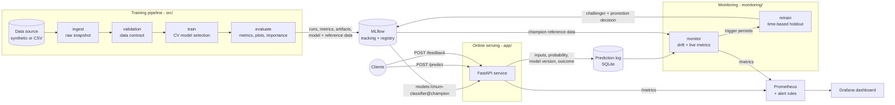

# Architecture

This system predicts customer churn and keeps the prediction model healthy on
its own: it trains and tracks models, serves the current champion, records every
prediction, collects ground truth, detects drift and retrains - promoting a new
model only when it measurably beats the one in production.

## Components

| Component | Code | Responsibility |
|-----------|------|----------------|
| Configuration | `src/config.py`, `configs/config.yaml` | Typed, validated settings; `MLOPS__SECTION__KEY` environment overrides |
| Feature contract | `src/schema.py` | Names, types, ranges and categories of every input - the single source of truth |
| Ingestion | `src/ingest.py` | Synthetic churn source with drift controls, or a CSV; writes an immutable snapshot |
| Validation | `src/validation.py` | Blocks training on contract violations; normalises dtypes |
| Features | `src/preprocess.py` | Feature engineering + imputation/scaling/encoding as one scikit-learn `Pipeline` |
| Training | `src/train.py` | Cross-validated model selection (nested MLflow runs), evaluation, logging, registration |
| Evaluation | `src/evaluate.py` | Metrics, confusion matrix, ROC/PR curves, permutation importance |
| Registry | `src/registry.py` | Champion/challenger aliases, promotion gate, decision tags, rollback |
| Inference | `src/predict.py` | Loads a registered model with lineage; batch scoring CLI |
| Prediction log | `src/prediction_store.py` | Durable record of predictions and the ground truth that arrives later |
| API | `app/` | FastAPI endpoints, request validation, Prometheus instrumentation, champion hot reload |
| Drift | `monitoring/drift.py` | PSI per feature and on predictions, with KS / chi-squared tests |
| Monitor | `monitoring/monitor.py` | Monitoring cycles, reports, Prometheus exporter, retraining triggers |
| Retraining | `monitoring/retrain.py` | Retrains on fresh labeled data and hands the result to the promotion gate |
| Simulator | `monitoring/simulate.py` | Realistic client traffic (optionally drifted) with delayed ground truth |
| S3 publishing | `src/s3.py` | Optional upload of data snapshots and reports to S3-compatible storage |

## Runtime topology (docker compose)

| Service | Image | Port | Lifecycle | Depends on |
|---------|-------|------|-----------|------------|
| `mlflow` | `churn-mlops` | 5000 | long-running | - |
| `trainer` | `churn-mlops` | - | one-shot, idempotent | `mlflow` healthy |
| `api` | `churn-mlops` | 8000 | long-running | `trainer` completed |
| `monitor` | `churn-mlops` | 8001 | long-running | `trainer` completed |
| `prometheus` | `prom/prometheus:v3.5.5` | 9090 | long-running | `api`, `monitor` |
| `grafana` | `grafana/grafana:13.2.2` | 3000 | long-running | `prometheus` |
| `simulator` | `churn-mlops` | - | on demand (`demo` profile) | `api` healthy |

Named volumes hold state: `mlflow-data` (tracking database and model artifacts),
`app-data` (raw snapshots and the prediction log, shared by `api` and `monitor`),
`reports`, `prometheus-data` and `grafana-data`. `docker compose down -v` resets
everything.

Startup is ordered by health checks: the trainer waits for a healthy MLflow
server, and the API and monitor wait for the trainer to finish. The trainer uses
`--skip-if-champion-exists`, so restarting the stack never retrains needlessly.

## Key design decisions

**One image for every Python service.** The MLflow server, trainer, API, monitor
and simulator all run the same image. That guarantees MLflow client/server version
parity and keeps builds to one cached dependency layer. The trade-off is a larger
API image than strictly necessary; a production deployment would split slim
per-service images.

**Alias-based deployment.** The API serves `models:/churn-classifier@champion` and
polls the registry (every 10 s in compose). Promotion and rollback are registry
operations; the API swaps models atomically with no restart, and in-flight
requests finish on the model they started with.

**Evidence-based promotion.** A new version becomes champion only if it passes
absolute quality gates *and* beats the current champion by a margin on the
*same* evaluation data. Every decision and its evidence is written to the model
version's tags.

**Safe model artifacts.** Models are serialised with skops instead of pickle.
Loading can only instantiate an explicit allow-list of types (`TRUSTED_TYPES` in
`src/train.py`), so a tampered artifact cannot execute arbitrary code.

**No training/serving skew.** Feature engineering lives inside the model
pipeline, and the API schema, data validation and drift detection all derive
from `src/schema.py`.

**Drift statistics implemented directly.** PSI, KS and chi-squared tests are
implemented with scipy (about 200 lines, unit-tested against known
distributions) rather than a heavyweight monitoring framework. This keeps images
small and makes every threshold explicit and calibrated for this data.

**Debounced, guarded retraining.** A trigger must persist for two consecutive
cycles, a cooldown prevents retraining storms, and retraining needs a minimum
amount of fresh ground truth. Retraining uses a *time-based* holdout, because a
random split would leak future behaviour into training.

**SQLite where a single node suffices.** The MLflow backend and prediction log
use SQLite (WAL mode) to keep the stack dependency-free. Both sit behind
interfaces that map directly to Postgres (MLflow `--backend-store-uri`) or a
warehouse table (`PredictionStore`).

## Security

- Containers run as an unprivileged user (uid 10001); no secrets are baked into images.
- The MLflow server enforces an explicit `--allowed-hosts` list (DNS-rebinding protection).
- `POST /model/reload` requires `X-Admin-Token` when `ADMIN_TOKEN` is set.
- Model artifacts load through the skops allow-list rather than pickle.
- Request payloads are validated strictly (unknown fields, out-of-range values and
  unknown categories are rejected with HTTP 422); batch size is capped.
- Telemetry from MLflow is disabled in the image.

## Scaling notes

The API runs one Uvicorn worker per container, which keeps Prometheus metrics
exact without multiprocess mode; scale horizontally by running more replicas
behind a load balancer. For multi-node deployments, move the MLflow backend to
Postgres with S3/GCS artifact storage and the prediction log to a shared
database or event stream.
