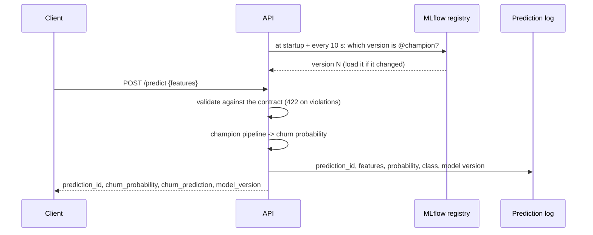
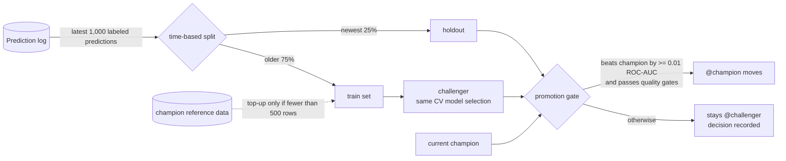

# Data flow

## The data

### Feature contract

Every component reads the same contract from `src/schema.py`:

| Feature | Type | Allowed values | Nullable |
|---------|------|----------------|----------|
| `tenure_months` | numeric | 0 - 120 | no |
| `monthly_charges` | numeric | 0 - 500 | no |
| `total_charges` | numeric | 0 - 60,000 | yes - missing for customers not billed yet |
| `num_support_tickets` | numeric | 0 - 100 | no |
| `avg_monthly_gb` | numeric | 0 - 5,000 | yes - telemetry gaps |
| `senior_citizen` | binary | 0 / 1 | no |
| `paperless_billing` | binary | 0 / 1 | no |
| `has_tech_support` | binary | 0 / 1 | no |
| `contract_type` | categorical | `month_to_month`, `one_year`, `two_year` | no |
| `internet_service` | categorical | `dsl`, `fiber_optic`, `none` | no |
| `payment_method` | categorical | `electronic_check`, `mailed_check`, `bank_transfer`, `credit_card` | no |

The label is `churned` (0/1); `customer_id` is carried for traceability and never
used as a feature.

### Where the data comes from

The default source is a **synthetic data-generating process** for a subscription
business (`src/ingest.py`). It is reproducible, needs no download or licence,
and - crucially for an MLOps system - can be shifted on purpose:

- **Covariate drift** moves the inputs: prices rise (up to +30%), more customers
  are on month-to-month contracts, fiber adoption grows and support tickets increase.
- **Concept drift** changes how customers behave: a competitor sells cheap fiber,
  so customers become more price-sensitive, DSL customers defect, loyalty from
  tenure erodes and payment method stops mattering.

`DriftProfile.from_strength(s)` combines both for `s` in [0, 1]. The generator is
calibrated so the baseline looks like telecom churn data (about 26% churn) and so
that drift genuinely hurts a stale model: at `s = 1` a model trained on the old
market drops to ~0.76 ROC-AUC while one retrained on 1,200 fresh rows reaches ~0.82.

Any real dataset that satisfies the contract can be used instead
(`data.source: csv`, `data.csv_path: ...`).

## Flows

### 1. Training

```mermaid
sequenceDiagram
    participant T as src.train
    participant S as Data source
    participant V as Validation
    participant M as MLflow
    T->>S: load (synthetic or CSV)
    S-->>T: raw table
    T->>T: write immutable snapshot data/raw/churn.csv
    T->>V: validate against the contract
    V-->>T: report (abort on any error)
    T->>T: stratified train / test split
    loop every candidate x hyper-parameters
        T->>M: nested run with 5-fold CV metrics
    end
    T->>T: fit best candidate, evaluate on test split
    T->>M: params, metrics, plots, importance, dataset lineage
    T->>M: model (skops) + reference data + test predictions
    T->>M: register version, tag @challenger
    T->>M: promotion gate vs @champion on the same test split
```

Artifacts logged per run: `evaluation/` (metrics, classification report, confusion
matrix, ROC and PR curves, permutation importance), `reference/` (training rows
used as the drift baseline, champion predictions on held-out rows as the
prediction-drift baseline), `model/` and `promotion_decision.json`. Train and
evaluation datasets are recorded as MLflow dataset inputs (schema, digest, row count).

### 2. Inference

The pipeline applies feature engineering, imputation, scaling and encoding
itself, so the API passes raw features straight through.

### 3. Ground truth (feedback)

Whether a customer actually churned is only known later. Clients send
`POST /feedback {prediction_id, churned}`, which attaches the outcome to the logged
prediction. The simulator reports outcomes for 80% of predictions by default, a
realistic label coverage.

### 4. Monitoring

Each cycle (every 30 s in compose, `python -m monitoring.monitor --once` locally):

1. Resolve `@champion` and download its reference data from MLflow.
2. Read the latest `monitoring.window_size` (1,000) predictions from the log.
3. Compute PSI for every feature and for the predicted probabilities, with KS or
   chi-squared tests as supporting evidence. A feature drifts at PSI >= 0.2; the
   dataset drifts when at least 15% of features (2 of 11) drift.
4. Compute live metrics on labeled predictions served by the champion.
5. Write `reports/monitoring/monitoring_<timestamp>.{json,html}` plus `latest.*`
   (served at `http://localhost:8001/report`) and update Prometheus gauges.
6. If dataset drift or a live metric below its threshold persists for two cycles,
   retrain.

### 5. Retraining

Retraining uses only the recent regime - the same window the monitor judged -
and holds out the *newest* rows, so the promotion decision reflects the market
the model will actually face next.

## Storage locations

| Data | Local run | Docker compose |
|------|-----------|----------------|
| Raw snapshots | `data/raw/` | `app-data` volume |
| MLflow runs, registry | `mlflow.db`, `mlruns/` | `mlflow-data` volume (served by the `mlflow` service) |
| Prediction log | `data/predictions/predictions.db` | `app-data` volume (shared by `api` and `monitor`) |
| Monitoring reports | `reports/monitoring/` | `reports` volume, served at `:8001/report` |
| Metrics | - | `prometheus-data` volume |

All generated data is git-ignored and reproducible from code. With
`storage.s3.enabled: true`, raw snapshots and monitoring reports are also
published to S3 (or any S3-compatible store).
