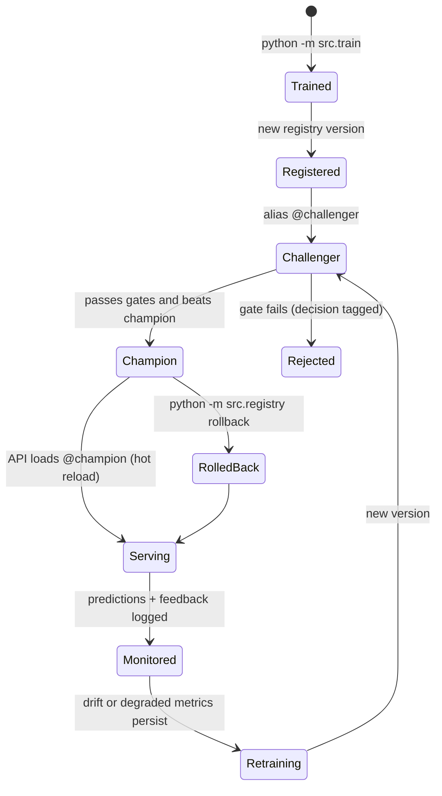
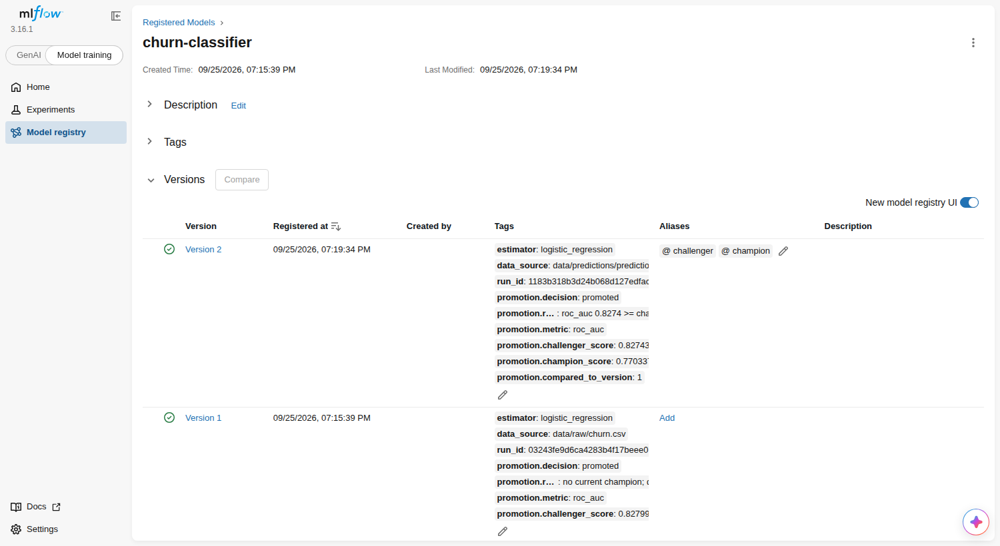

# Model lifecycle

How a model is born, promoted, served, watched and replaced - as it actually runs
in this repository.



## 1. Train

`python -m src.train` (the `trainer` service in compose):

- Ingests a raw snapshot and validates it against the data contract. Violations
  (missing columns, out-of-range values, unknown categories, too many nulls, a
  single-class target) stop the run before any model is trained.
- Cross-validates every configured candidate - logistic regression, random forest
  and histogram gradient boosting, each with a small hyper-parameter grid - and
  selects the best mean ROC-AUC.
- Refits the winner on the full training split and evaluates it on the held-out
  split: accuracy, precision, recall, F1, ROC-AUC, average precision, log loss,
  Brier score, plus plots and permutation importance.

The decision threshold is 0.35 rather than 0.5. Missing a churner costs more
than an unnecessary retention offer, and on the test split 0.35 raises recall
from 0.45 to 0.65 (F1 from 0.52 to 0.60) for the same ROC-AUC.

## 2. Track

Each training run records, in MLflow:

| What | Where |
|------|-------|
| Data source, sizes, churn rate, CV folds, threshold, seed | run params |
| One nested run per candidate configuration with CV mean/std metrics | child runs |
| Test metrics (`test_*`), champion metrics on the same data (`champion_*`) | run metrics |
| Train/evaluation dataset schema and digest | dataset inputs |
| Plots, reports, permutation importance | `evaluation/` artifacts |
| Drift baseline (training rows) and prediction baseline | `reference/` artifacts |
| Model: skops-serialised pipeline, signature, input example, pinned requirements | logged model |
| Promotion decision and its evidence | `promotion_decision.json`, run tags |

Open the UI with `mlflow ui --backend-store-uri sqlite:///mlflow.db` locally, or
at <http://localhost:5000> in compose.

## 3. Register and promote

Every trained model becomes a new version of `churn-classifier` with alias
`@challenger`. The promotion gate (`src/registry.py::decide_promotion`) then
evaluates the current champion **on the challenger's evaluation data** and
promotes only if:

1. the challenger passes every absolute gate (`registry.promotion.min_metrics`:
   ROC-AUC >= 0.75, F1 >= 0.45), **and**
2. its ROC-AUC is at least the champion's + 0.01 (`min_improvement`), so noise
   cannot replace a model.

The first model only needs to pass the gates. Every decision (`promoted` /
`rejected`, the reason, both scores and the compared version) is written to the
version's tags - an audit trail of what served production and why.

## 4. Deploy

Deployment is moving an alias. The API resolves `@champion` to a concrete
version at startup, then checks every `serving.reload_interval_seconds` (10 s in
compose). When the alias moves, it loads the new version and swaps it in
atomically. No rebuild, restart or downtime; `GET /model` and every prediction
response report the serving version. `POST /model/reload` forces an immediate check.

## 5. Monitor

The monitor (see [data flow](data-flow.md#4-monitoring)) compares the latest
1,000 predictions with the champion's reference data and measures live
performance on labeled feedback. It publishes:

- **Reports** - JSON and HTML per cycle; the latest at <http://localhost:8001/report>.
- **Metrics** - drift share, per-feature PSI, prediction PSI, live ROC-AUC/F1,
  window size, champion version and retraining outcomes, scraped by Prometheus.
- **Alerts** - Prometheus rules for data drift, low live ROC-AUC, a stale monitor,
  API errors, latency, a missing model and prediction-log failures
  (`monitoring/prometheus/alerts.yml`, visible at <http://localhost:9090/alerts>).

## 6. Retrain

Retraining is triggered when dataset drift or a live metric below
`monitoring.performance_thresholds` persists for two consecutive cycles, subject
to guard rails:

| Guard | Default | Why |
|-------|---------|-----|
| Trigger persistence | 2 cycles | Drift appears while a shift is still rolling out; waiting lets post-shift data accumulate |
| Cooldown | 30 min (2 min in compose) | Prevents retraining storms if a challenger keeps losing |
| Minimum ground truth | 500 labeled predictions | Too little data produces a noisy challenger |

The retrainer trains on the latest 1,000 labeled predictions, holds out the
newest 25% and runs the standard pipeline, including the promotion gate. On the
shifted market used in the demo, the challenger reaches about 0.82-0.83 ROC-AUC
on the holdout against about 0.77-0.78 for the stale champion and is promoted.
On unchanged data it cannot beat the champion by the margin and is rejected.
Both cases are covered by tests.



## 7. Roll back

```bash
python -m src.registry list               # versions, aliases, decisions
python -m src.registry rollback           # champion -> previously promoted version
python -m src.registry promote --version 3
```

In compose, prefix with `docker compose exec api`. The API follows the alias
within one reload interval.

## Operational runbook

| Symptom | Where to look | Action |
|---------|---------------|--------|
| `/ready` returns 503 | `GET /ready` detail, `docker compose logs api` | Check that MLflow is reachable and `@champion` exists (`src.registry list`); run the trainer |
| `ChurnDataDriftDetected` alert | <http://localhost:8001/report> | Confirm which features moved; retraining follows automatically once ground truth arrives |
| `ChurnLiveRocAucLow` alert | Grafana "Live model quality" panel | Check the latest retraining outcome in the report; roll back if a recent promotion regressed |
| Retraining keeps being rejected | version tags in `src.registry list` | Inspect challenger vs champion scores; more labeled data may be needed |
| `ChurnPredictionLogFailing` alert | API logs | Disk or volume problem: predictions are still served but monitoring loses data |
| Bad model promoted | `src.registry list` | `python -m src.registry rollback` |
